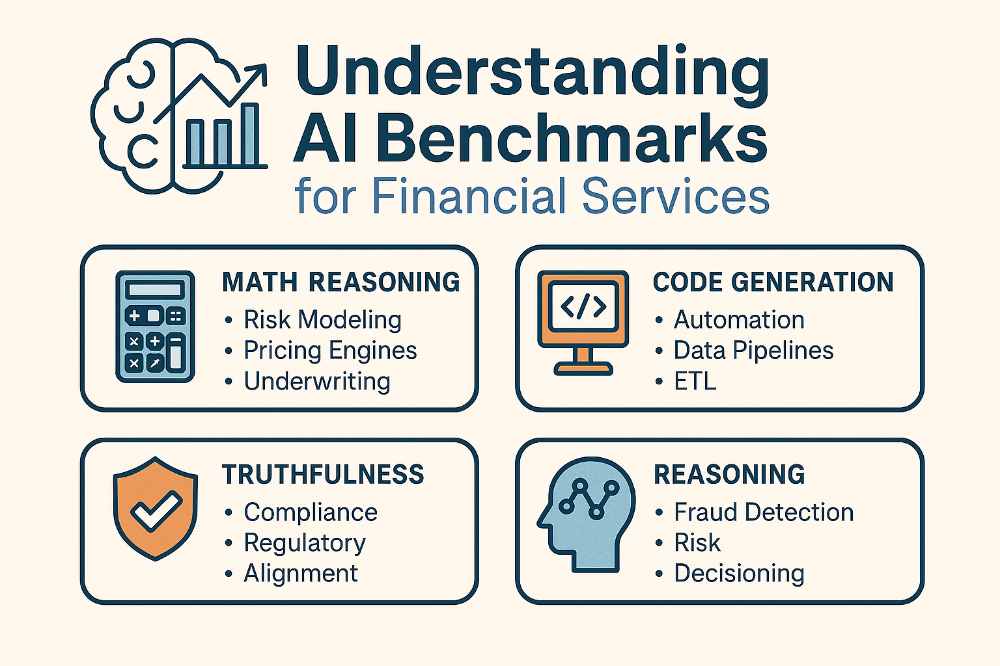

In a sector where precision is paramount and missteps are costly, choosing the right AI model is far more than a technical preference. It’s a matter of sound judgement. This piece cuts through the clutter to show which benchmarks genuinely matter for financial services, and which models are truly up to the task.

# Introduction 
AI model benchmarks can feel abstract with publications using a sea of acronyms like *GSM8K*, *MMLU*, *TruthfulQA*, and *HumanEval*. But for financial services, these benchmarks map directly to real operational needs: risk modeling, compliance, automation, fraud detection, and customer experience. This post tries to break down each benchmark in plain language, explains why it matters, and ranks them by **financial‑services relevance**. All data is sourced from publicly available model evaluations from Microsoft, OpenAI, Anthropic, Meta, and academic benchmark suites. 

---

# Why Benchmarks Matter in Financial Services 
Financial institutions rely on AI for: 

- Risk & pricing models
- Regulatory compliance & auditability 
- Fraud detection & anomaly reasoning
- Customer support automation 
- Developer productivity & quant tooling

Benchmarks help us understand which models excel at: 

- Math reasoning 
- Code generation 
- Truthfulness 
- Logical reasoning 
- Document understanding 

These capabilities directly map to FS workflows. 

---

# Benchmark Table (Sorted by FS Relevance) 

Below is the full benchmark table, sorted from **most relevant → least relevant** for financial services.

| Benchmark | Category | What It Tests | Real‑World FS Usage | Top 5 Models (Best → Worst) | 
|---|---|---|---|---| 
| GSM8K CoT | Math Reasoning | Step-by-step math logic | Risk modeling, pricing engines, underwriting, portfolio optimization | Phi‑3‑Medium, Phi‑3‑Small, Claude Sonnet, GPT‑3.5, Phi‑3‑Mini | 
| HumanEval | Code Generation | Writing functions | Automation, ETL, quant infra, API wrappers | Claude Sonnet, GPT‑3.5, Llama‑3, Phi‑3‑Small, Phi‑3‑Mini | 
| MBPP | Code Reasoning | Solving coding problems | Backtesting, feature engineering, data validation | Claude Sonnet, GPT‑3.5, Phi‑3‑Medium, Phi‑3‑Small, Llama‑3 | 
| TruthfulQA | Safety | Avoiding hallucinations | Compliance, regulatory reporting, audit trails | Claude Sonnet, Phi‑3‑Medium, GPT‑3.5, Phi‑3‑Small, Mixtral | 
| ARC Challenge | Reasoning | Hard logic | Fraud detection, scenario analysis, stress testing | Claude Sonnet, Phi‑3‑Medium, Phi‑3‑Small, GPT‑3.5, Mixtral | 
| ARC Easy | Reasoning | Basic logic | Decision trees, rule-based automation | Phi‑3‑Medium, Phi‑3‑Small, Claude Sonnet, GPT‑3.5, Mixtral | 
| BoolQ | NLP + Reasoning | Yes/no with context | Customer support, policy Q&A | Claude Sonnet, Phi‑3‑Medium, Phi‑3‑Small, Mixtral, Llama‑3 | 
| CommonsenseQA | Commonsense | Everyday logic | Fraud heuristics, intent detection | Claude Sonnet, Phi‑3‑Medium, Phi‑3‑Small, Mixtral, Llama‑3 | 
| ANLI | NLP | Contradiction detection | Contract review, policy comparison | Claude Sonnet, Phi‑3‑Medium, Llama‑3, Mixtral, Phi‑3‑Small | 
| HellaSwag | NLP | Sentence prediction | Email drafting, workflow completion | Phi‑3‑Medium, Claude Sonnet, Phi‑3‑Small, Llama‑3, Mixtral | 
| WinoGrande | NLP | Pronoun resolution | KYC/AML extraction, document parsing | Claude Sonnet, Phi‑3‑Small, Phi‑3‑Medium, GPT‑3.5, Mixtral | 
| MMLU | Knowledge | Academic knowledge | Analyst training, research copilots | Phi‑3‑Medium, Phi‑3‑Small, Claude Sonnet, GPT‑3.5, Mixtral | 
| BigBench Hard | Reasoning | Abstract reasoning | Agentic workflows, complex planning | Phi‑3‑Medium, Phi‑3‑Small, Mixtral, GPT‑3.5, Phi‑3‑Mini | 
| AGI Eval | General Reasoning | Broad intelligence | Autonomous workflows | GPT‑3.5, Claude Sonnet, Phi‑3‑Medium, Mixtral, Phi‑3‑Small | 
| PIQA | Physical Reasoning | Object affordances | UX reasoning | Claude Sonnet, Phi‑3‑Medium, Phi‑3‑Small, GPT‑3.5, Mixtral | 
| Social IQA | Social Reasoning | Social situations | Customer empathy, HR bots | Claude Sonnet, Phi‑3‑Medium, Phi‑3‑Small, Mixtral, Llama‑3 | 
| TriviaQA | Knowledge | Trivia recall | Search assistants | GPT‑3.5, Mixtral, Claude Sonnet, Llama‑3, Gemma | 
| MedQA | Medical | Medical exam questions | Not relevant to FS | Claude Sonnet, GPT‑3.5, Mixtral, Llama‑3, Phi‑3‑Medium | 

---

# Key Insights for Financial Services 

## 1. Math + Code Benchmarks Matter Most 
GSM8K, HumanEval, and MBPP directly correlate with: 

- Pricing models 
- Risk engines 
- Quant research 
- Automation pipelines 

Models like **Phi‑3‑Medium** and **Claude Sonnet** consistently lead here. 

## 2. Truthfulness Is Critical for Compliance 
TruthfulQA is a strong predictor of: 

- Reduced hallucinations 
- Better regulatory alignment 
- Safer customer facing outputs 

Claude Sonnet and Phi‑3‑Medium dominate this category. 

## 3. Reasoning Benchmarks Predict Fraud & Risk Performance 
ARC Challenge and CommonsenseQA map to: 

- Fraud detection 
- Scenario analysis 
- Edge-case reasoning 
These are essential for FS risk teams. 

--- 

# Conclusion 
Benchmarks aren’t abstract — they map directly to financial workflows. Models like **Phi‑3‑Medium**, **Claude Sonnet**, and **GPT‑3.5** consistently perform well across the categories that matter most for financial services. 

While evaluating models for FS use cases, one will prioritize: 

1. Math reasoning 
2. Code generation 
3. Truthfulness 
4. Hard reasoning 
5. Document NLP 

This gives you the strongest operational ROI. 

---
*The benchmark results, model comparisons, and financial‑services relevance assessments in this post are based on publicly available information from model providers and academic benchmark suites. They are intended for **informational and educational purposes only**.* 

# References 

- Microsoft. *Phi‑3 Model Family Benchmarks*. 
- OpenAI. *GPT‑3.5 and GPT‑4 Technical Evaluations*. 
- Anthropic. *Claude 3 Model Card & Benchmarks*. 
- Meta AI. *Llama‑3 Performance Benchmarks*. 
- Hendrycks et al. *MMLU: Measuring Massive Multitask Language Understanding*. 
- Cobbe et al. *GSM8K: Grade School Math Benchmark*. 
- Chen et al. *Evaluating Large Language Models on Code Generation (HumanEval)*. 
- Srivastava et al. *BIG-Bench: Beyond the Imitation Game Benchmark*. 
- Zellers et al. *HellaSwag Benchmark*. 
- Bisk et al. *PIQA: Physical Interaction QA*. 
- Sap et al. *Social IQA Benchmark*. 
- Lin et al. *TruthfulQA Benchmark*. 
- Clark et al. *CommonsenseQA Benchmark*